# Cartoonization

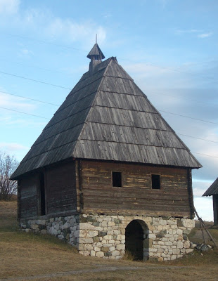
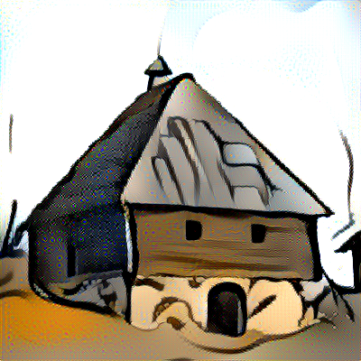    

 There are many methods that can cartonify picture. One of those methods include usage of neural networks and neural style transfer technique using cartoon pictures as style images.
 Idea behind this technique is to have separated images, one that contains content (shape, objects...) and the other that contains style (colours, textures...) , and *combine* them into one image. Combining includes applying layer upon layer on of style image on content image.
 We use vgg19 pretrained neural network to extract specific layers and use them to define content and style of newly generated image. To extract style from an image, we use multiple layers to define textures that will be transfered. Unlike style, content of an image is extracted from one specific layer.  
 Im mathematical terms, this process is an optimization process and in this notebook we use stochastic gradient descent as an optimization method.
 Loss function is derived into two separate loss functions (content loss and style loss), but because this is style transfer, the most important thing is that the resulting image is appealing for the viewer. This techique is also used to create new images using famous paintings.
 
 | Content | Style | Combination |
 |---------|-------|-------------|
 | 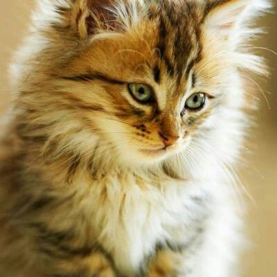 | 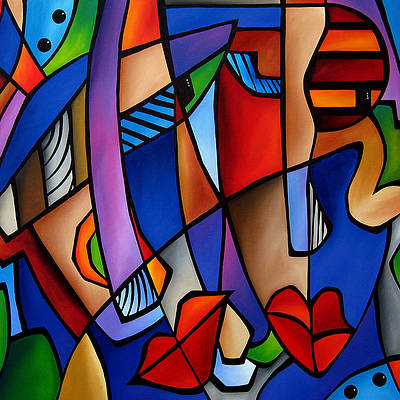| 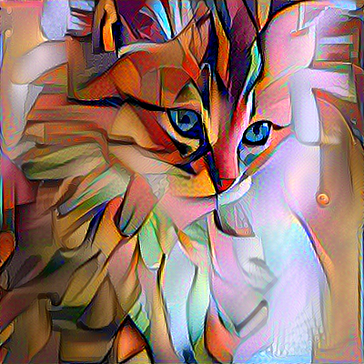|
 
 | Content | Style | Combination |
 |---------|-------|-------------|
 |  | | 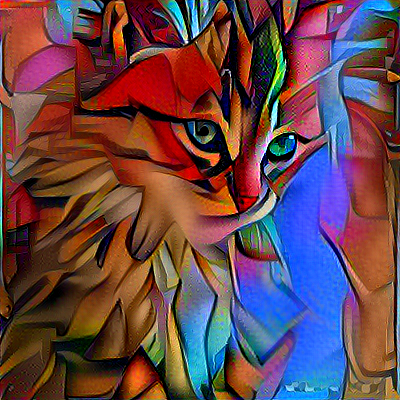|
 
 
 | Content | Style | Combination |
 |---------|-------|-------------|
 | 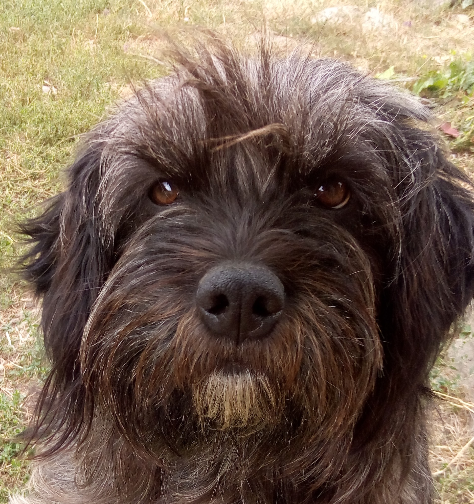 | | 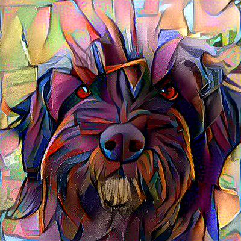|
 
 
 #### Cartoon images
 
 Beside monitoring loss function, important parameters are:
 - layers that we use to extract features of an image
 - weight that are used to balance influences of style and content of new image
 - learning rate of gradient descent

Choosing this parameters we generate very different and interesting images
 
 | Content | Style | Combination |
 |---------|-------|-------------|
 |  | 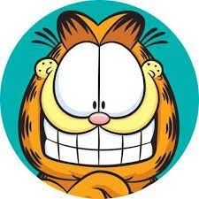| 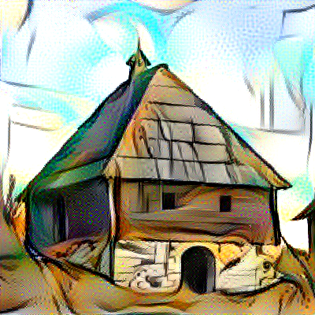|
 
 
 | Content | Style | Combination |
 |---------|-------|-------------|
 |  | | 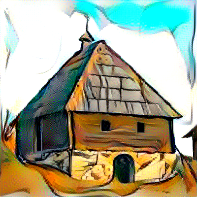|
 
 
 
 | Content | Style | Combination |
 |---------|-------|-------------|
 |  | 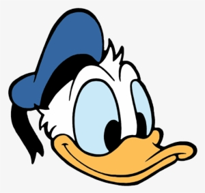| |
 
 
  #### Cartoon images
Papers and tutorials used to create this project are listed in resources.md  
Requirements are listed in requirements.txt
